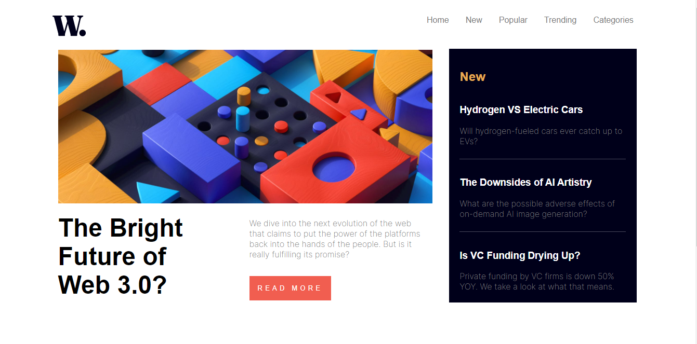
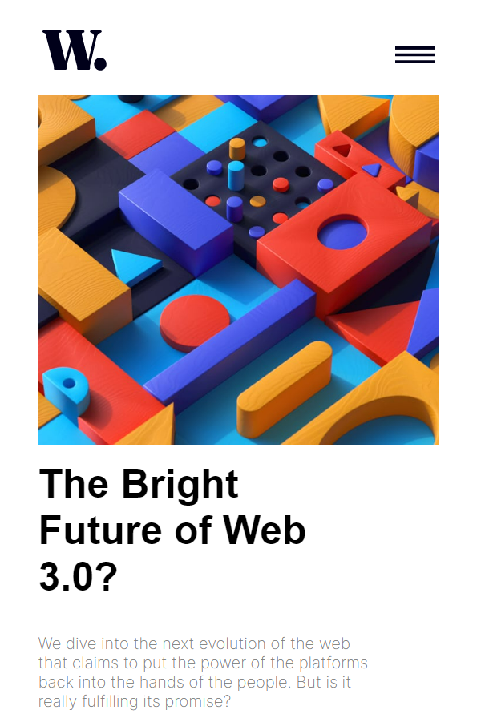

# Frontend Mentor - News homepage solution

This is a solution to the [News homepage challenge on Frontend Mentor](https://www.frontendmentor.io/challenges/news-homepage-H6SWTa1MFl). Frontend Mentor challenges help you improve your coding skills by building realistic projects. 

## Table of contents

- [Overview](#overview)
  - [The challenge](#the-challenge)
  - [Screenshot](#screenshot)
  - [Links](#links)
- [My process](#my-process)
  - [Built with](#built-with)
  - [What I learned](#what-i-learned)
- [Author](#author)

**Note: Delete this note and update the table of contents based on what sections you keep.**

## Overview

### The challenge

Users should be able to:

- View the optimal layout for the interface depending on their device's screen size
- See hover and focus states for all interactive elements on the page

### Screenshot



### Links

- Solution URL: [Add solution URL here](https://github.com/cassiamoraes/New-HomePage)
- Live Site URL: [Add live site URL here](https://your-live-site-url.com)

## My process

### Built with

- Semantic HTML5 markup
- CSS custom properties
- Flexbox
- CSS Grid
- SCSS
- Mobile-first workflow
- JS
- [Styled Components](https://styled-components.com/) - For styles

### What I learned

To see how you can add code snippets, see below:

```html
<div class="menu">
  
  
  <ul>
  <li><a href="http://">Home</a></li>
  <li><a href="http://">New</a></li>
  <li><a href="http://">Popular</a></li>
  <li><a href="http://">Trending</a></li>
  <li><a href="http://">Categories</a></li>
  </ul>
  </div>
```
```css
.menu{
    display: block;
    margin-left: 51rem;
    margin-top: 5rem;
    margin-bottom: -1rem;
    color: gray;

    a:hover{
            color: hsl(35, 77%, 62%);
        }

    img{
            display: none;
        }
}
```
```js
function showContent(){

    if(content.style.display == 'block'){
        content.style.display = 'none'
    }else{
        content.style.display = 'block'
        document.body.style.backgroundColor = 'rgba(0, 0, 1, 0.200)'
        document.body.style.overflow = 'hidden'        
    }
}
```
## Author

- LinkedIn - [Cassia Moraes](https://www.linkedin.com/in/cassia-moraes-797797139)
- Frontend Mentor - [@cassiality](https://www.frontendmentor.io/profile/cassiality)
